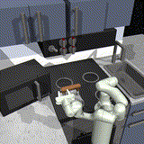

# SMODICE: Versatile Offline Imitation Learning via State Occupancy Matching

This is the codebase accompanying "SMODICE: Versatile Offline Imitation Learning via State Occupancy Matching".

## SMODICE Demos
  |   |   |  
:-------------------------:|:-------------------------:|:-------------------------:|:-------------------------:

## Tabular Experiments

1. Offline Imitation Learning from Mismatched Experts 
```
python smodice_tabular/run_tabular_mismatched.py
```

2. Offline Imitation Learning from Examples
```
python smodice_tabular/run_tabular_example.py
```

## Deep IL Experiments
### Setup
1. Create conda environment and activate it:
     ```
     conda env create -f environment.yml
     conda activate smodice
     pip install --upgrade numpy
     pip install torch==1.7.1+cu110 torchvision==0.8.2+cu110 torchaudio===0.7.2 -f https://download.pytorch.org/whl/torch_stable.html
     git clone https://github.com/rail-berkeley/d4rl
     cd d4rl
     pip install -e .

### Offline IL from Observations
1. Run the following command with variable ```ENV``` set to any of ```hopper, walker2d, halfcheetah, ant, kitchen```.  
```
python run_oil_observations.py --env_name $ENV
```
2. For the AntMaze environment, first generate the random dataset:
```
cd envs
python generate_antmaze_random.py --noise
```
Then, run
```
python run_oil_antmaze.py
```

### Offline IL from Mismatched Experts
1. For ```halfcheetah``` and ```ant```, run
```
python run_oil_observations.py --env_name halfcheetah --dataset 0.5 --mismatch True
```
and
```
python run_oil_observations.py --env_name ant --dataset disabled --mismatch True
```
respectively. 
2. For AntMaze, run
```
python run_oil_antmaze.py --mismatch True
```

### Offline IL from Examples
1. For the PointMass-4Direction task, run
```
python run_oil_examples_pointmass.py
```
2. For the AntMaze task, run
```
python run_oil_antmaze.py --mismatch False --example True
```
3. For the Franka Kitchen based tasks, run
```
python run_oil_examples_kitchen.py --dataset $DATASET
```
where ```DATASET``` can be one of ```microwave, kettle```.

### Baselines
For any task, the ```BC``` baseline can be run by appending ```--disc_type bc``` to the above commands.

For ```RCE-TD3-BC``` and ```ORIL``` baselines, on the appropriate tasks, append ```--algo_type $ALGO``` where ```ALGO``` can be one of ```rce, oril```. 

## Acknowledgment
This codebase is partially adapted from [optidice](https://github.com/secury/optidice), [rce](https://github.com/google-research/google-research/tree/master/rce), [relay-policy-learning](https://github.com/google-research/relay-policy-learning), and [d4rl](https://github.com/rail-berkeley/d4rl) ; We thank the authors and contributors for open-sourcing their code. 